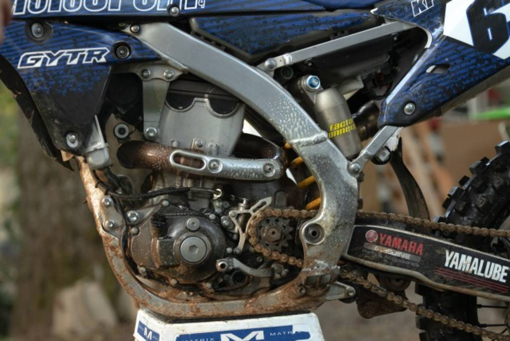
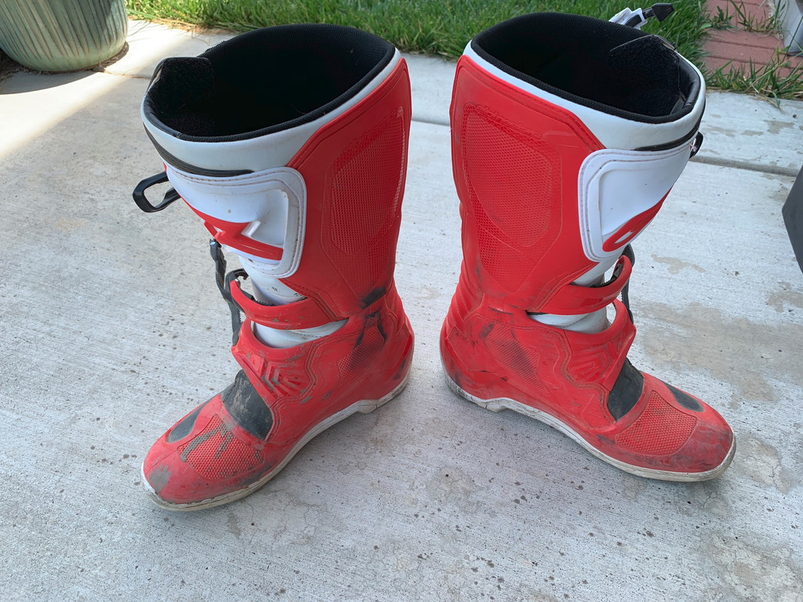
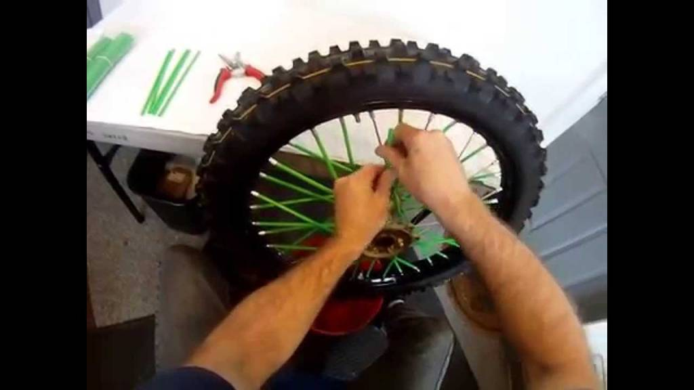

:orphan:

.. START - 20190914.0907.kdx175.Engine.Engine_removal.Title.Main_Shop

Engine removal
==============

.. END - 20190914.0907.kdx175.Engine.Engine_removal.Title.Main_Shop

.. contents::
   :local:
   :depth: 1

.. raw:: html

    <!--
    .. START - 20190914.0907.kdx175.Engine.Engine_removal.Log_Link.Main_Shop
    Click here to see the `entire Log Entry <20190914.0907.kdx175.Engine.Engine_removal.Log.Main_Shop.html>`__
    .. END - 20190914.0907.kdx175.Engine.Engine_removal.Log_Link.Main_Shop
    -->

.. START - 20190914.0907.kdx175.Engine.Engine_removal.Teaser.Main_Shop

+--------------------------------------------------+------------------------------------------------------------------------------------------------------------------------------------------------------+
| | Completed exams and know have time to          | .. figure:: ./_static/images/20190914.0907.kdx175.Engine.Engine_removal.Log.Main_Shop^201909140907_000.png                                           |
| | get back to work on the KDX. Engine removal    |    :align: right                                                                                                                                     |
| | and necesarry parts such as the seat and tank  |    :figwidth: 300px                                                                                                                                  |
| | removed. One of the engine bolts was rusted    |    :target: ./_static/images/20190914.0907.kdx175.Engine.Engine_removal.Log.Main_Shop^201909140907_000.png                                           |
| | so it was cut.                                 |                                                                                                                                                      |
| |                                                |    Your uploaded image "000" is displayed here                                                                                                       |
| | One person can do this in a crouched position  |                                                                                                                                                      |
| | if care is used                                |                                                                                                                                                      |
+--------------------------------------------------+------------------------------------------------------------------------------------------------------------------------------------------------------+

.. END - 20190914.0907.kdx175.Engine.Engine_removal.Teaser.Main_Shop

Section for your image 201909140907_001.jpeg
--------------------------------------------

.. figure:: ./_static/images/20190914.0907.kdx175.Engine.Engine_removal.Log.Main_Shop^201909140907_001.jpeg
   :scale: 50%
   :alt: 20190914.0907.kdx175.Engine.Engine_removal.Log.Main_Shop^201909140907_001.jpeg

Caption for the image goes here

   The legend consists of all elements after the caption.  In this
   case, the legend consists of this paragraph.

Section for your image 201909140907_002.jpeg
--------------------------------------------

Caption for the image goes here

   The legend consists of all elements after the caption.  In this
   case, the legend consists of this paragraph.

Section for your image 201909140907_003.png
-------------------------------------------

Caption for the image goes here

   The legend consists of all elements after the caption.  In this
   case, the legend consists of this paragraph.

Section for your image 201909140907_004.jpeg
--------------------------------------------

.. figure:: ./_static/images/20190914.0907.kdx175.Engine.Engine_removal.Log.Main_Shop^201909140907_004.jpeg
   :scale: 50%
   :alt: 20190914.0907.kdx175.Engine.Engine_removal.Log.Main_Shop^201909140907_004.jpeg

Caption for the image goes here

   The legend consists of all elements after the caption.  In this
   case, the legend consists of this paragraph.

Video Section Example
---------------------

Replace "Video Section Example" with your own Section Title.
This demonstrates how to embed a video that is hosted on youtube.
This example section may be editied and used or removed.

.. raw:: html

    

    <iframe width="100%" height="350" src="https://www.youtube.com/embed/JKCC4Tcx18A?rel=0" frameborder="0" allow="autoplay; encrypted-media" allowfullscreen></iframe>
    

Online Image Section Example
----------------------------

Replace "Online Image Section Example" with your own Section Title.
This shows how to embed an image that is on a different site.
This example section may be editied and used or removed.

.. figure:: https://secure.zeald.com/site/bearingses/images/items/NR_BALL_BEARING.jpg
   :target: https://secure.zeald.com/site/bearingses/images/items/NR_BALL_BEARING.jpg
   :alt: one ball bearing required

   Caption for the image goes here

   This is the legend which consists of all elements after the caption.  In this
   case, the legend consists of this paragraph.

Uploaded Image Section Example
------------------------------

Replace "Uploaded Image Section Example" with your own Section Title.
This shows how to embed an image that you upload.
This example section may be editied and used or removed.

   Caption for the image

   This is the legend which consists of all elements after the caption.  In this
   case, the legend consists of this paragraph.

Project Numbers
---------------

.. raw:: html

    
    <table id="example" class="display table table-bordered" style="width:100%">
    <thead>
    <tr>
    <th> 
    #  </th><th align="left"> Parts & 3rd-party Labor</th><th align="left"> Source         </th><th class="sum">       Cost</th><th class="sum">My Time</th>
    </tr>
    </thead>
    <tfoot>
        <tr>
            <th></th>
            <th></th>
            <th align="right">Sums</th>
            <th align="right"></th>
            <th align="right"></th>
        </tr>
    </tfoot>
    <tbody>
    <!-- START - 20190914.0907.kdx175.Engine.Engine_removal.Parts.Main_Shop -->

.. raw:: html

    <tr>
    <td> 1  </td><td> no parts or tools bought   </td><td>                                                            </td><td align="right">           </td><th  align="right">       </th>
    </tr>
    <!-- END - 20190914.0907.kdx175.Engine.Engine_removal.Parts.Main_Shop -->

.. raw:: html

    </tbody>
    </table>
