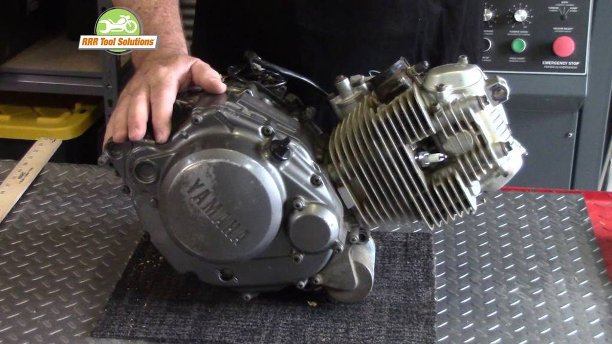

Jul-15-2019 | `Engine Logs <engine_logs.html>`__ | `Prep for Engine Removal <engine_20190715.html>`__

.. toctree::
   :maxdepth: 2
   :caption: Contents:

+-----------------------------------------------------------------------------------------------+
| Prep for Engine Removal                                                                       |
+--------------------------------------------------+--------------------------------------------+
| * Remove all components                          | .. figure:: ./_static/images/extract.jpeg  |
| * Degrease                                       |    :align: right                           |
| * Wire wheel and/or Sanding                      |    :figwidth: 300px                        |
| * Chemical Degrease                              |    :target: ./_static/images/extract.jpeg  |
| * Dry                                            |                                            |
|                                                  |    Finding the floor jack                  |
| | The steam cleaner is offline so do it          |                                            |
| | by hand                                        |                                            |
+--------------------------------------------------+--------------------------------------------+

.. _extensions: http://www.sphinx-doc.org/en/master/ext/builtins.html#builtin-sphinx-extensions

Today's video
-------------

This screencast will help you get started or you can
read our guide below

.. raw:: html

    

    <iframe width="100%" height="350" src="https://www.youtube.com/embed/JKCC4Tcx18A?rel=0" frameborder="0" allow="autoplay; encrypted-media" allowfullscreen></iframe>
    

Quick start
-----------

The approach relies on two core technologies: deep learning and photonic time stretch. Deep learning is a type of machine learning, an artificial intelligence technique in which algorithms are “trained” to perform tasks using large volumes of data. In deep learning, algorithms called neural networks are modeled after how the human brain works. Compared to other types of machine learning, deep learning has proven to be especially effective for recognizing and generating images, speech, music and videos.

Figure
------

   This is the caption of the figure (a simple paragraph).

   The legend consists of all elements after the caption.  In this
   case, the legend consists of this paragraph and the following
   table:

The End for today
-----------------

Parts, equipment, supplies, services, etc
+----------------+----------------+----------------+----------------+----------------+
|       1        | Bolt           |     3.00       |    Burbank     |                |
+----------------+----------------+----------------+----------------+----------------+

.. raw:: html

    
    <table id="example" class="display table table-bordered" style="width:100%">
    <thead>
    <tr>
    <th>&nbsp;</th>
    <th>Position</th>
    <th>Office</th>
    <th>Age</th>
    <th>Start date</th>
    <th>Salary</th>
    </tr>
    </thead>
    <tbody>

<!-- dbRowsParts -->

.. raw:: html

    <tr>
    <th>&nbsp;</th>
    <td>System Architect</td>
    <td>Edinburgh</td>
    <td>61</td>
    <td>2011/04/25</td>
    <td>$320,800</td>
    </tr>
    <tr>
    <th>&nbsp;</th>
    <td>Accountant</td>
    <td>Tokyo</td>
    <td>63</td>
    <td>2011/07/25</td>
    <td>$170,750</td>
    </tr>
    </table>

